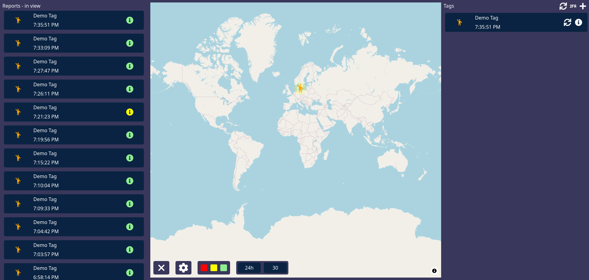
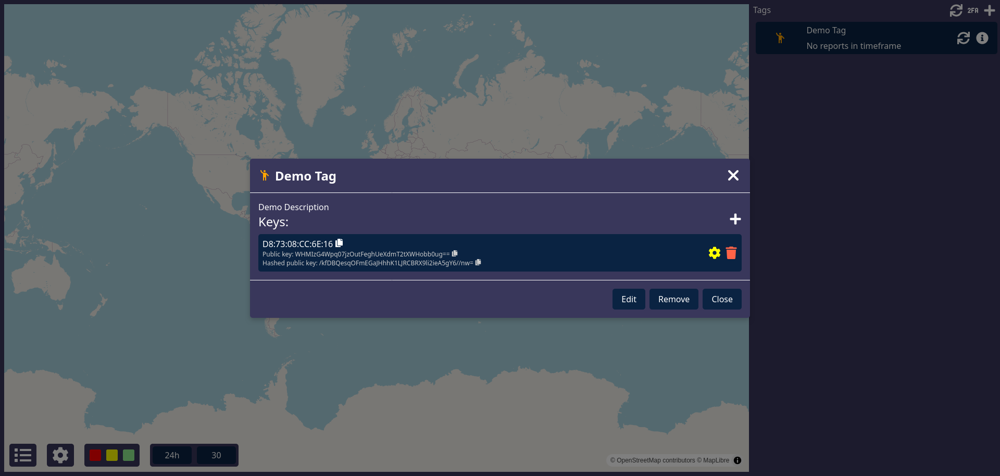
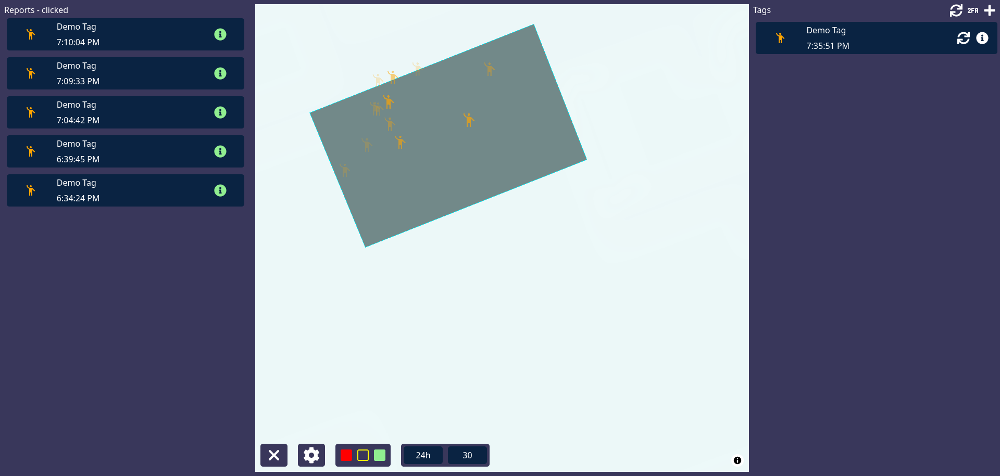

## FindMy Dashboard
Probably the easist way to manage and visualize your Openhaystack devices

FindMy Dashboard is a web-based dashboard for creating, managing and visualizing your Openhaystack devices. It uses [FindMy.py](https://github.com/malmeloo/FindMy.py) in the backend to fetch the location reports, decryptes them with the private keys stored in your local postgres database, saves the data to InfluxDB and visualizes
the data on a maplibre map. 

Currently only static openhaystack keys are supported, the web view is optimized for desktop use, a mobile view is planned, maybe even an app, or integration into an existing one.

> [!WARNING]  
> Currently, this project does not include authentication. The design is intended for self-hosting on a local network and is not meant to be exposed to the internet.

## Minidemo
|Reports of tag|Keys used on tag|Reports by tag|
|----|----|----|
||||

View all screenshots in the [docs](./docs/docs.md).

## Features
- 2FA login
- Add tags and keys, currently only supports static keys
- Fetch data via [FindMy.py](https://github.com/malmeloo/FindMy.py) and save to InfluxDB
- Show data on a map, request different time ranges & amount of reports
- View currently rendered reports in a list, or show the reports you have selected, accuracy circle
- Customize the map with your own style (e.g. maptiler)
- Customize tag icon and color
- Filter by report confidence or by tags (click on the tag icon to toggle visibility)

## Running
### Docker
The easiest way is to use the supplied `docker-compose.yml` file. It will start the following services:
- InfluxDB 2.x
    - The key data; location reports will be stored here
- Postgres
    - The dashboard data; tags, keys will be stored here
- Anisette server
    - Used by FindMy.py
    - (For now this is used, later this will be replaced by the built-in FindMy.py Anisette support)
- FindMy Dashboard
- cron
    - Periodically fetch data, default is every hour, <b>don't go below every 15 minutes</b> to avoid being banned
    - (For now its own separate service, but will later be done directly in the dashboard service)

### Step-by-step
1. Copy `docker-compose.env` to `.env` and place it next to the `docker-compose.yml` file. Fill in the values as instructed in the file. 
2. Run `docker compose up -d` to start the services.
3. Go to `http://localhost:8000`

<b>NOTE:</b> First time please wait for anisette to be ready, will update compose soon to wait for it automatically.

<b>NOTE:</b> The automatic fetching of data is not ready yet, nor is the sync all button. Need to use the new api, currently still on the old one, will be updated soon.

## Debug & Development

Copy `dev.env` to `.env` in the `server` directory and fill in the values. If you don't have have Anisette, postgres or InfluxDB running you can copy the docker compose and remove the `findmy-dashboard` service, then use that as a base to run as a local dev environment. (At some point I will make a separate dev compose)

### Server

1. `cd server`
2. `python -m venv .venv`
3. `. .venv/bin/activate`
4. Set python interpreter to the one in the .venv
5. `pip install -r requirements.txt`
6. `python app.py`

### Client

1. `cd client`
2. `npm i -g pnpm` (if you don't have it installed)
3. `pnpm i`
4. `pnpm dev`

## Building
- `docker build -t findmydashboard/full .`
- `docker push findmydashboard/full`

#### Roadmap:
- make a logo
- Flat color icons don't work!
- Auto wait for anisette server to be ready
- export/import keys and tags
- write more and better docs
- allow user to set when "low quality" is used
- generate binary for different chips
- event-driven stuff, based on device status byte AND/OR key used
- groups, both for data fetching, hide/show and to select bucket to save data in
- geofencing
- rehaul localstorage system, if used more
- incremental keys?
- better historical viewer
- allow devices to have same private key?
- influxdb bucket is hardcoded, allow user to change it, in the future.
- make some errors more informative
- code cleanup
    - move dialog code into different files
- sizing inconsistencies
- compile all theme stuff into one file and use variables better
- the reports info can get prettier
- error handling on some parts where very obscure errors could happen
- decrypt in browser, either input private key or store private key encrypted
- left click to quickly view detailed reports of click place?
- allow user to change where the differnt panels are and how big they are?
- maybe make the copy private key button select the text?
- pwa?

## Credits
- @malmeloo for [FindMy.py](https://github.com/malmeloo/FindMy.py)
- @biemster for [FindMy](https://github.com/biemster/FindMy)
- @Dadoum for [anisette-v3-server](https://github.com/Dadoum/anisette-v3-server)
- [Track You](https://petsymposium.org/popets/2023/popets-2023-0102.pdf) and [Who Can Find My Devices?](https://doi.org/10.2478/popets-2021-0045) (@seemo-lab)